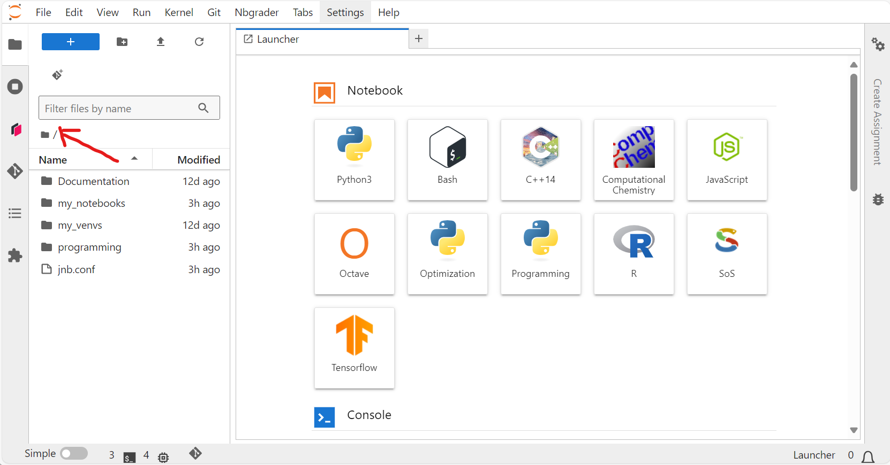
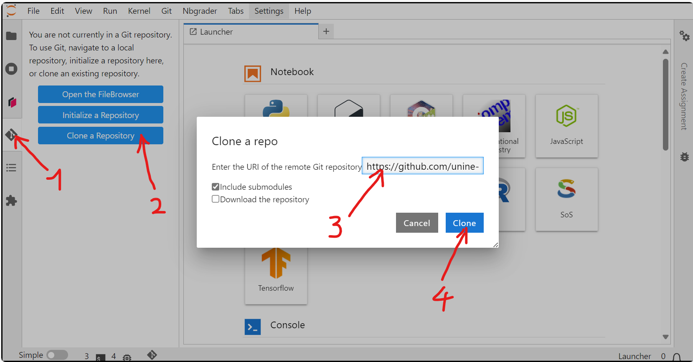

# Programming (5AF2029)

[Prof. Eric Simon](mailto:eric.simon@unine.ch)

## Course Material

This document explains how to clone the course material in [Noto](https://noto.epfl.ch/) and setup the environment to run the Jupyter notebooks.

### Deploy Key

The course material is available on [GitHub](https://github.com/) as a private repository, accessible only with a *Deploy Key*. This will be provided at the beginning of the course.

### Virtual Environment

The Jupyter notebooks require some Python modules that are not installed by default in Noto, like `yfinance` or `eurostatapiclient`. The recommendend way of installing third party modules in Python is to set up a virtual environment. This is the only way that will work in [Noto](https://noto.epfl.ch/).

To setup a suitable `programming` environment and an associated `Programming` Jupyter kernel, you can simply clone this repository in [Noto](https://noto.epfl.ch/).

## Cloning the Repository

To clone the public repository, follow these steps:

1. Login to [Noto](https://noto.epfl.ch/).
   
3. Ensure you are working in the root (home) folder `/`

     

4. Click on the Git icon on the left, Select "Clone a Repository", enter the following URL and click "Clone". 
    `https://github.com/unine-prog/administrativia.git`

     

## Download the Course Material

Once the above steps are done, you can go through and run the notebook [Download Course Material](https://noto.epfl.ch/hub/user-redirect/lab/tree/programming/administrativia/course-material/Download%20Course%20Material.ipynb) in Noto.